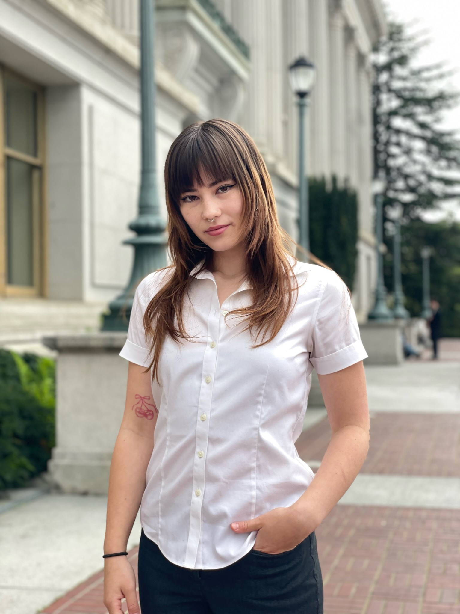

  

  

# Welcome to My Portfolio

Hello! I'm a Cognitive Science and Data Science student at UC Berkeley, passionate about neurotech, healthtech, and innovations that improve lives and uplift communities.

  

## Projects
- **Project Sonus**
  - [Project Homepage](https://tfussociety.miraheze.org/wiki/Main_Page) - FWI ultrasound brain imaging project.
- **U-Net FCN MRI Tumor Classification**
  - [Banquet Slide Deck](https://docs.google.com/presentation/d/1hrxFJ_2oNG2gDl1-EjpjD9lEy_CkqLDlOv4OzKYC4cc/edit#slide=id.p)
  - [Google Colab Notebook](https://colab.research.google.com/drive/1BZG8uK6YUqL9aYi-Dk8pFQcsqfyhE_HJ?usp=sharing)

- [NeuroTalk Podcast Episode](https://open.spotify.com/episode/11FaSkpjikXlh6dczcasaY?si=e7f978b079b64627) - A discussion of Neurotech@Berkeley's EEG-driven generative art model.

## Publications
- [MIND Magazine Article](https://neurotech.studentorg.berkeley.edu/MIND_F23.pdf) - Exploring holistic health and EEG-Guided Meditation.

## Résumé
[View My Résumé](https://github.com/bealowman/bealowman.github.io/raw/main/Lowman_Beatrice_Resume_03_13_25.docx.jpg)

## Contact
- [LinkedIn](https://www.linkedin.com/in/beatrice-lowman/)
- Email: bealowman@berkeley.edu
